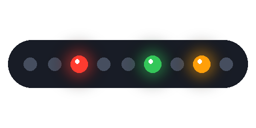
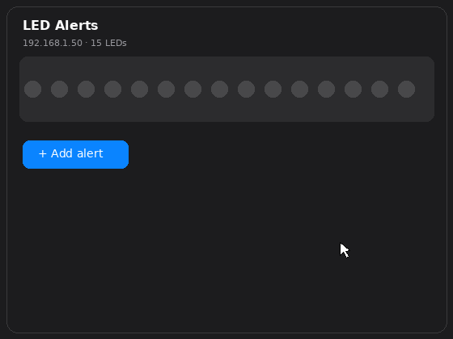

<p align="center"></p>

<h1 align="center">WLED Task Map</h1>

Light up LEDs on your WLED strip when something needs your attention.

Examples of what it can do:

- LED 3 turns **red** when your 3D printer goes into an error state
- LEDs 0–4 turn **green** when your shopping list has items on it
- LED 10 turns **orange** when a backup fails

You set all of this up by **tapping LEDs and picking colors in a visual card** — no YAML, no code.

<p align="center"></p>

Full reference (services, websocket API, troubleshooting): **[docs/documentation.md](docs/documentation.md)**

 

---

## What you need before starting

1. **Home Assistant** up and running.
2. **A WLED device** — an LED strip running [WLED](https://kno.wled.ge/) firmware, connected to your WiFi.
3. **The IP address of your WLED device** (looks like `192.168.1.50`). To find it: open the WLED app on your phone, or open Settings → Devices & Services → WLED in Home Assistant — the IP is shown on the device page. You can also check your router's device list.
4. **HACS** installed in Home Assistant. HACS is an app store for community add-ons. If you don't have it, follow the [official HACS install guide](https://hacs.xyz/docs/use/) first (one-time, ~10 minutes).

---

## Step 1 — Install the integration (via HACS)

1. In Home Assistant, click **HACS** in the left sidebar.
2. Click the **⋮ (three dots)** menu in the top-right corner → **Custom repositories**.
3. In the *Repository* field paste:
   ```
   https://github.com/nishithdev/wled-taskmap
   ```
4. In the *Type* dropdown pick **Integration**, then click **Add** and close the dialog.
5. In HACS, search for **WLED Task Map**, open it, and click **Download**.
6. **Restart Home Assistant**: Settings → System → click the power icon (top right) → Restart. Wait for it to come back up.

> Without the restart, nothing will work — don't skip step 6.

## Step 2 — Connect it to your WLED strip

1. Go to **Settings → Devices & Services**.
2. Click **+ Add Integration** (bottom right).
3. Search for **WLED Task Map** and click it.
4. Type your WLED device's **IP address** (from "What you need" above) and submit.

That's the entire configuration. If you get "Could not reach the WLED device", double-check the IP and that the strip is powered on.

## Step 3 — Add the card to your dashboard

1. Open any dashboard (e.g. **Overview** in the sidebar).
2. Click the **✏️ pencil** (top right) to enter edit mode.
3. Click **+ Add card**, scroll down or search for **WLED Task Map**, and click it. Click **Save**.
4. Click **Done** to leave edit mode.

> Card not in the list? Do a hard refresh of your browser: **Ctrl+Shift+R** (Windows) / **Cmd+Shift+R** (Mac). On the phone app: close and reopen the app.

You'll now see your LED strip drawn as a row of dots.

## Step 4 — Create your first alert

In the card:

1. Tap **＋ Add alert**.
2. **Tap the dots** (LEDs) on the strip that should light up. Drag across to select several. They glow in your chosen color so you can see exactly what you picked.
3. **Type the entity to watch** — start typing and pick from the suggestions. An *entity* is anything Home Assistant tracks: `sensor.printer_status`, `binary_sensor.front_door`, `todo.shopping_list`…
4. **Tap the states that should trigger the alert** — e.g. `error` and `unavailable`. (Skip this for to-do lists: they trigger automatically whenever they have pending items.)
5. **Pick a color** with the color picker.
6. Tap **Add alert**. Done — it's live immediately.

Your alerts are listed under the strip in plain language, e.g.:

> 🔴 **3D Printer** is error / unavailable → LED 3, 4, 5  ✏️ 🗑

Tap ✏️ to change anything, 🗑 to remove.

### How it behaves

- When a watched entity enters one of its trigger states, its LEDs light in the chosen color.
- When it recovers, those LEDs turn off.
- The rest of your strip is untouched — you can keep using WLED normally.

---

## Common questions

**Which states should I pick?**
`unavailable` and `error` are good defaults for most devices. For sensors that signal a problem by turning "on" (door open, leak detected, low battery), pick `on`. Not sure what states an entity has? Open it in Developer Tools → States and watch what it reports.

**My strip has no segments configured — is that OK?**
Yes. A fresh WLED install works out of the box; LED numbers simply count from the start of the strip (first LED = 0).

**Can two alerts share the same LEDs?**
Yes — if both trigger, the newer rule's color wins.

**LEDs lit up that I didn't expect?**
One of your watched entities is probably `unavailable` (device offline). That's the alert doing its job — or a sign to remove that mapping.

## For advanced users: trigger from automations

Any automation can light an LED directly — useful for things that aren't entities (webhooks, script failures, CI builds):

```yaml
action:
  - service: wled_taskmap.set_alert
    data:
      led: 5
      color: "FF6600"
```

`wled_taskmap.clear_alert` (with `led`) turns it back off; `wled_taskmap.clear_all` clears all manual alerts.

## Manual installation (without HACS)

Download this repository, copy the `custom_components/wled_taskmap` folder into your Home Assistant `config/custom_components/` folder, restart HA, then continue from **Step 2**.

## License

MIT
